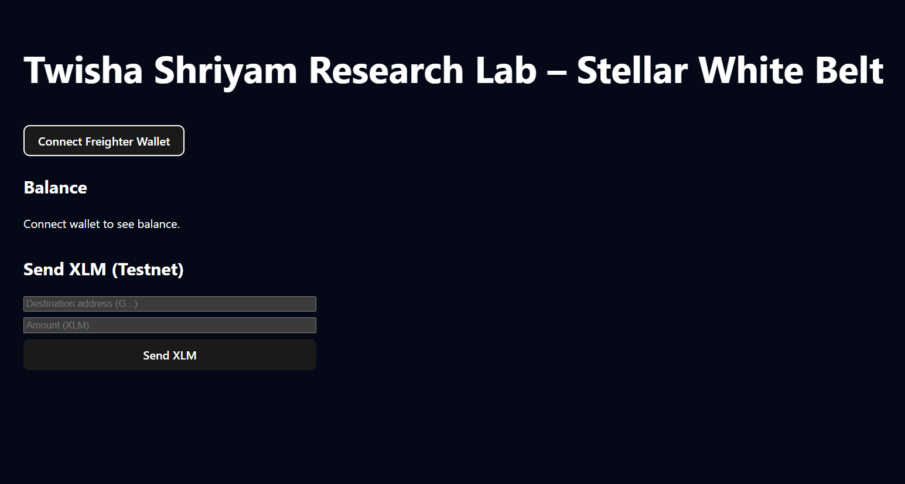

# Twisha Shriyam Research Lab – Stellar Journey to Mastery

# Kaiitzn Pocket Pay – a simple Stellar testnet wallet for students, built as the foundation of a campus micro‑payments and earning app.

This repo tracks a full progression through the **Stellar Journey to Mastery: Monthly Builder Challenges** – from basic wallets to a production‑style dApp with real users and metrics.

> Tracks covered:
> - 🥋 **Builder Track (Belts)** – Levels 1–6

## 1. Project Overview

This project is a research & engineering sandbox under **Twisha Shriyam Research Lab for kaiitzn startup**, focused on:

- Learning Stellar and Soroban by **shipping real dApps**.
- Iteratively evolving one codebase from:
  - ⚪️ Wallet + first transaction →  
  - ⚫️ Production‑ready application with metrics, security, and Demo Day pitch.

At a high level, the app evolves through these phases:

- **Level 1–2** – Simple payment dApp → multi‑wallet + basic Soroban contract + events.
- **Level 3–4** – Mini dApp with tests, caching, CI/CD, mobile responsiveness, advanced contracts.
- **Level 5–6** – Real MVP with users, feedback, metrics, monitoring, security, advanced features (e.g., fee sponsorship or multi‑sig).

---

## 2. Tech Stack

- **Frontend:** React + TypeScript, Vite or Next.js.
- **Styling:** Tailwind CSS / Chakra UI (mobile‑first responsive design).
- **Wallets:**  
  - Freighter, xBull, Albedo (via `@creit.tech/stellar-wallets-kit`).
- **Blockchain / Smart Contracts:**
  - Stellar testnet / Futurenet.
  - Soroban smart contracts (Rust).
- **Backend / Indexer (later belts):**
  - Node.js or Python service for event ingestion + indexing.
  - PostgreSQL / Supabase for storing indexed data and metrics.
- **Tooling & Infrastructure (later belts):**
  - GitHub Actions for CI/CD.
  - Vercel / Netlify for deployments.
  - Sentry / similar for monitoring & error tracking.

---

## 3. Builder Track – Belt Progression

### 3.1 Belt Levels (Program Summary)

This repo follows the official **Belt System** of the Builder Track:

| Belt | Level | Focus |
|------|-------|-------|
| ⚪️ White | 1 | Wallets & first testnet transactions |
| 🟡 Yellow | 2 | Multi‑wallet flows, Soroban contracts, event handling |
| 🟠 Orange | 3 | Fully working mini dApp, tests, caching, demo video |
| 🟢 Green | 4 | Advanced contracts + production readiness (CI/CD, mobile) |
| 🔵 Blue | 5 | Real MVP + at least 5 testnet users |
| ⚫️ Black | 6 | Scale to 20–30+ users, metrics, security, monitoring, Demo Day |

---
## Screenshots

### Wallet connected

**Implemented Level 1 requirements:**

- ✅ Freighter wallet setup and connection on **Stellar Testnet** (Twisha Shriyam Research Lab – KPP)  
- ✅ Wallet connect and disconnect buttons in the UI  
- ✅ Fetch and display connected wallet’s **XLM balance** on Testnet  
- ✅ Send **XLM transaction on Testnet** from the connected wallet  
- ✅ Show transaction feedback:
  - Success / failure state  
  - Transaction hash / confirmation message

  # KPP Level 2 extends the student wallet into a multi‑wallet Stellar dApp with a simple Soroban contract and real‑time status updates for contract calls still developing .
  
### Contact Us
We are **open for feedback** and collaboration.
(preferred for quick questions and dev chats)  
- Rise In: **Twili** OR Twisha on the whatsapp group of Rise in – available via the Rise In platform and whatsapp for program‑related discussions and feedback

Feel free to reach out for:
- Suggestions and feature ideas
- Code reviews or pairing
- Feedback on UX, architecture, or documentation

